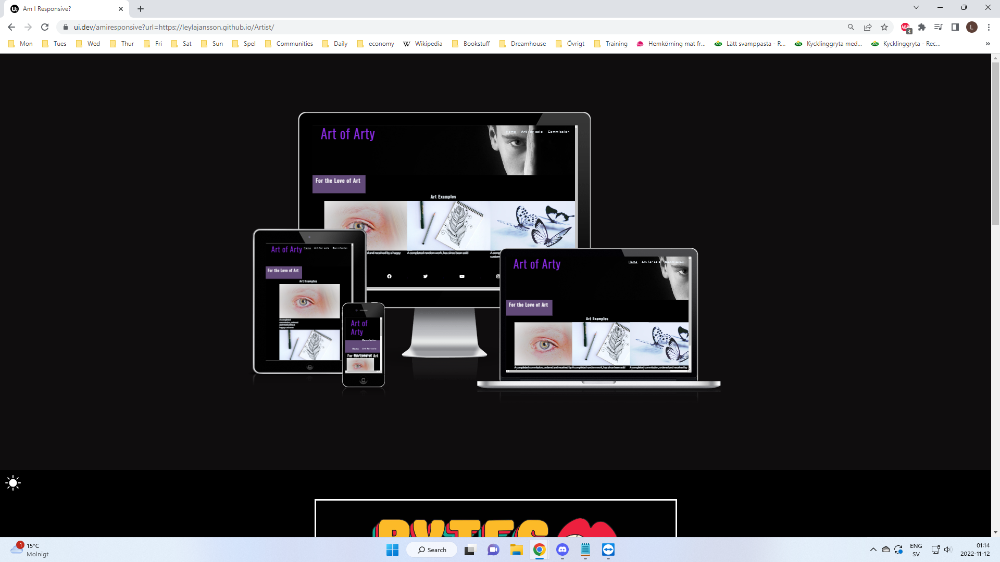
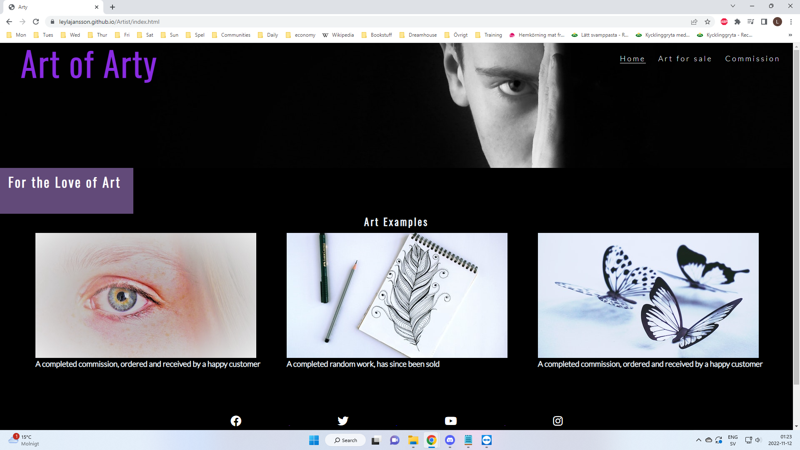
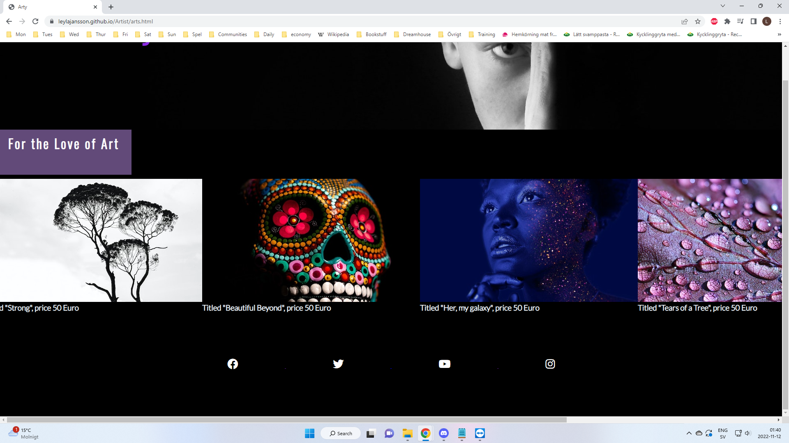
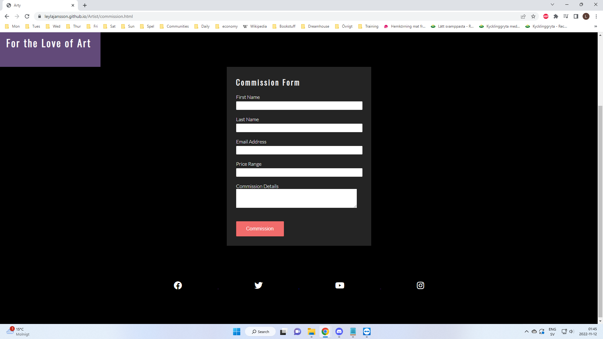

# Arty

Art of Arty is a site that showcases the art the artist Arty has for sale. It aims to sell the art he's completed and to allow for commissions for his work to be made. The website will be targetting art lovers and art collectors.

 

## Features 

- __Navigation Bar__

  - Featured on all three pages, the full responsive navigation bar includes links to the Logo, Home page, Gallery and Sign Up page and is similar in each page to allow for easy navigation.
  - This section will allow the user to easily navigate from page to page across all devices without having to revert back to the previous page via the ‘back’ button. 

- __Header__

  - The header shows the name of the site, in the color purple.
  - The header clearly shows what this site is for.

- __Art Examples__

  - This section shows examples of art the artist has created. 
  - This allowes users to see the abilities of the artist. This should encourage the user to consider buying an artpiece or commission the artist. 

- __The Footer__ 

  - The footer section includes links to the relevant social media sites for Art of Arty. The links will open to a new tab to allow easy navigation for the user. 
  - The footer is valuable to the user as it encourages them to keep connected via social media.

- __Art for Sale__

  - Showcases the art that is currently ready and unsold. 
  - This section is valuable to the user as they will be able to easily see the various options they can buy. 

- __Commission__

  - This page will allow the user to send commission requests to the artist, or buy the finished artworks available. The user will be asked to submit their full name and email address, as well as a price range and details or name of the requested art.

## Testing 

I have tested this page in different browsers, namely: Chrome and Firefox.
I have confirmed this page is responsive, looks good on standard screen sizes using the devtools device bar.
I confirmed the text on the page is readable and easy to understand.
I have tested that the form works as it should.

### Validator Testing 

- HTML
  - No errors were returned when passing through the official [W3C validator](https://validator.w3.org/nu/?doc=https%3A%2F%2Fcode-institute-org.github.io%2Flove-running-2.0%2Findex.html)
- CSS
  - One error was found in style.css on line 184, this was left unsolved as any fix I tried only made more problems. [(Jigsaw) validator](https://jigsaw.w3.org/css-validator/validator?uri=https%3A%2F%2Fvalidator.w3.org%2Fnu%2F%3Fdoc%3Dhttps%253A%252F%252Fcode-institute-org.github.io%252Flove-running-2.0%252Findex.html&profile=css3svg&usermedium=all&warning=1&vextwarning=&lang=en#css)

### Unfixed Bugs

Hero image too large for the smaller screens. Left it as is for now, due to timecrunch, since it looks fine without it.
Error found in css validator. Left as is until solution can be found.

## Deployment

This section should describe the process you went through to deploy the project to a hosting platform (e.g. GitHub) 

- The site was deployed to GitHub pages. The steps to deploy are as follows: 
  - In the GitHub repository, navigate to the Settings tab 
  - From the source section drop-down menu, select the Master Branch
  - Once the master branch has been selected, the page will be automatically refreshed with a detailed ribbon display to indicate the successful deployment. 

The live link can be found here - https://leylajansson.github.io/Artist/index.html

## Credits 

Code for social media links are copied from the Love running project.
Images are from Pexels.com
The icons in the footer were taken from [Font Awesome](https://fontawesome.com/)
Template used for README comes from Codeinstitute.net